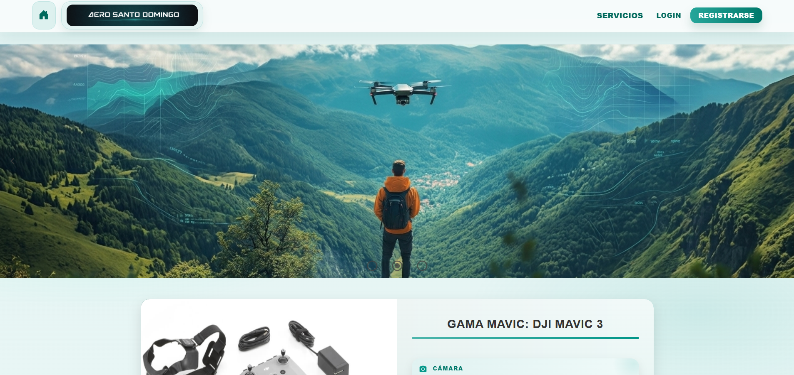
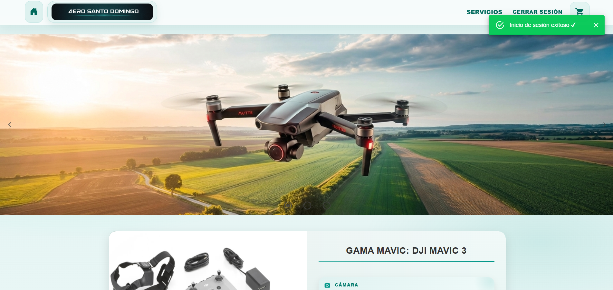
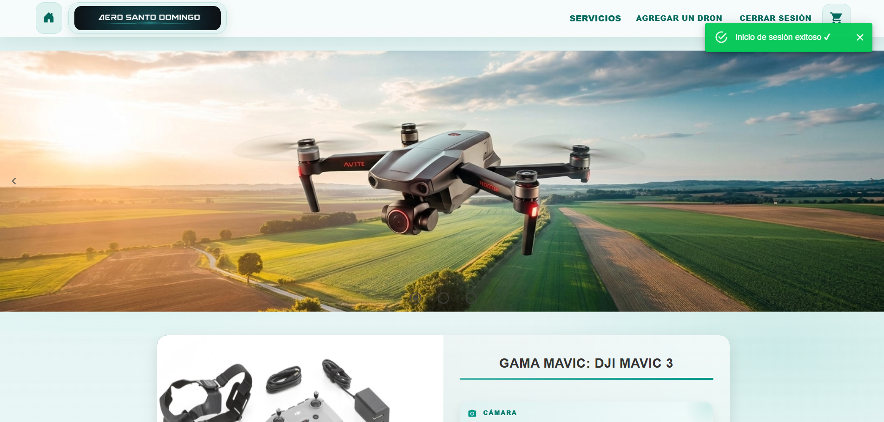
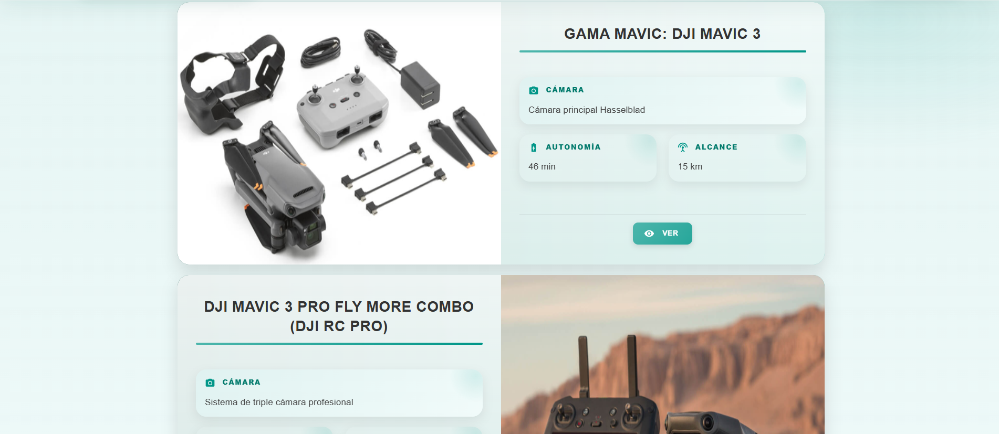
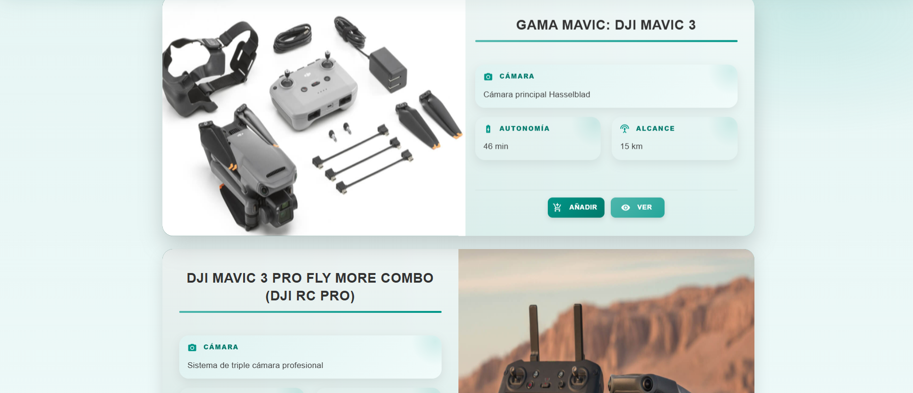
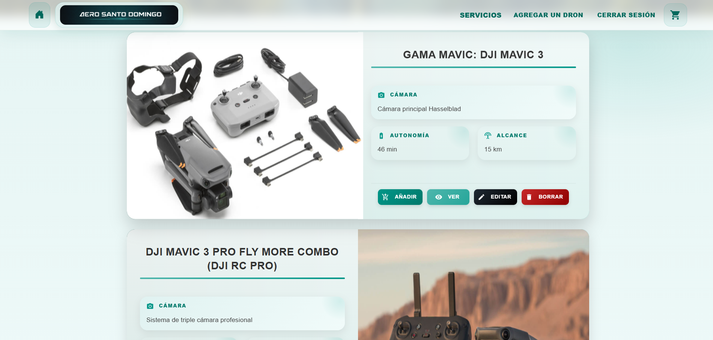
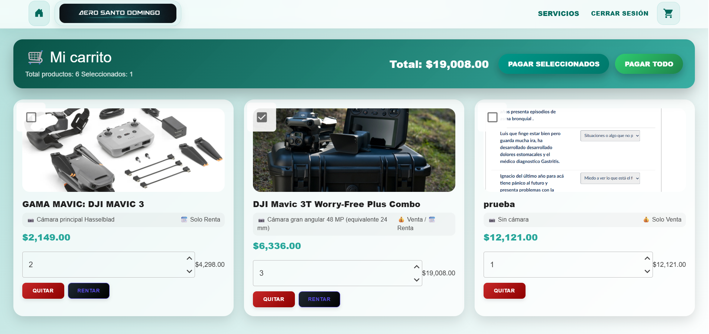
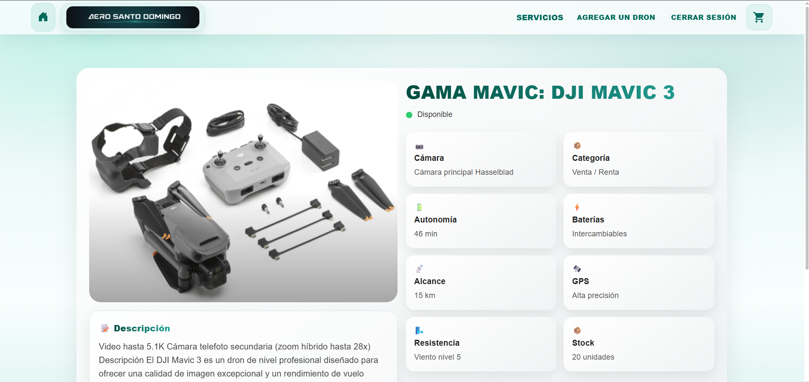
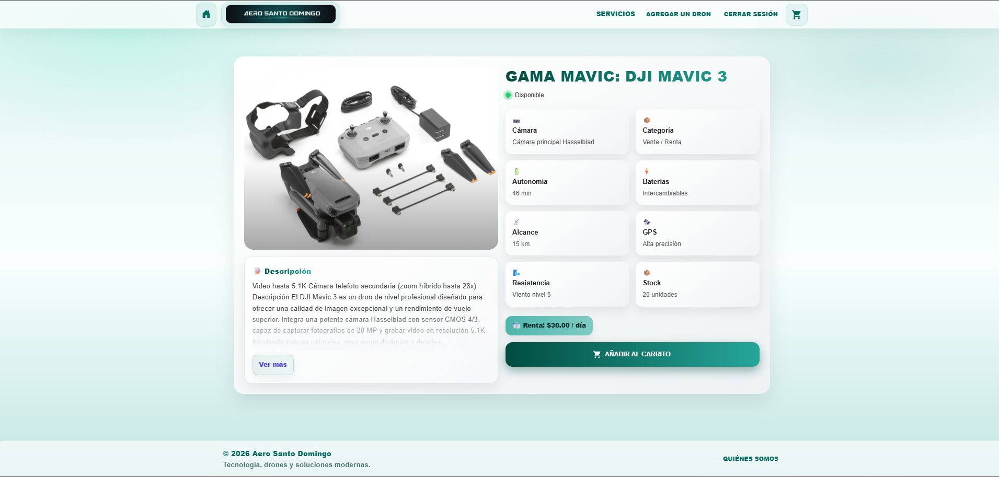
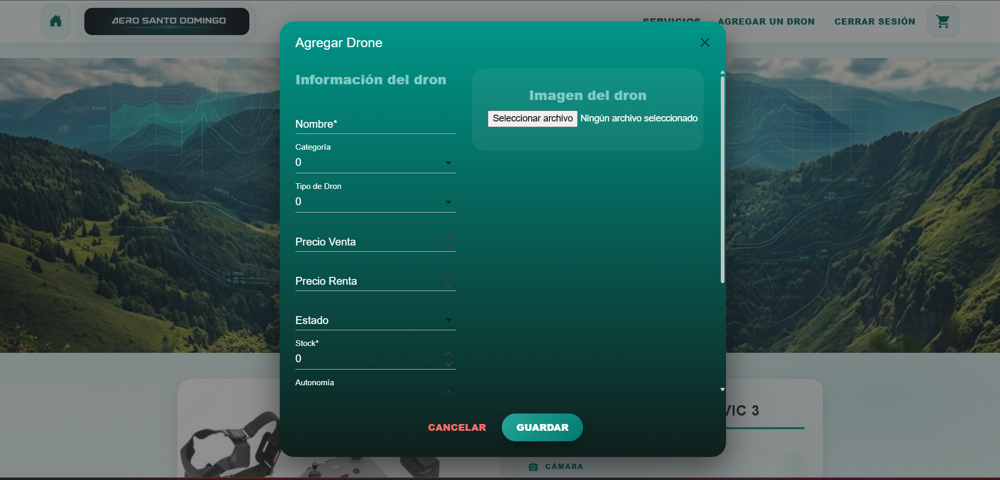

🚁 Web Drones - E-commerce Platform

📌 Descripción del Proyecto

Web Drones es una plataforma de comercio electrónico desarrollada en ASP.NET Core + Blazor + MudBlazor, enfocada en la venta y gestión de drones.

El sistema permite a los usuarios explorar productos, filtrarlos por categorías, agregarlos al carrito y realizar procesos de compra, mientras que los administradores pueden gestionar inventario, precios y disponibilidad.

🚀 Tecnologías Utilizadas
ASP.NET Core (.NET)
Blazor Server
MudBlazor (UI Framework)
Entity Framework Core
SQL Server
C#
HTML / CSS / Bootstrap (complementario)
🧠 Funcionalidades Principales
👤 Usuario Cliente
Visualización de drones en catálogo
Filtros por categoría y precio
Detalle de producto
Carrito de compras
Gestión de cantidades
🛠️ Administrador
CRUD de drones
Gestión de categorías
Control de inventario
Gestión de precios y disponibilidad
🖼️ Capturas del Sistema (IMPORTANTE AQUÍ VAN LAS FOTOS)
🏠 Página principal (Index foto de como lo veria un vistante sin permisos)

(Index foto de como lo veria un cliente con cuenta)
.

(Index foto de como lo veria un admin)
.

🚁 Catálogo de drones

(Index foto de como lo veria un vistante sin permisos)

(Index foto de como lo veria un cliente con cuenta)
.

(Index foto de como lo veria un admin)
.

🛒 Carrito de compras
(carrito foto de como lo veria un cliente con cuenta)
.

📄 Detalle del drone
(Details esta foto no tiene -zoom)

(Details esta foto tiene -zoom)
.

🛠️ Panel de administración
.

Arquitectura del Proyecto

El proyecto sigue una arquitectura por capas:

Web Drones
│
├── Data (DbContext + configuración)
├── Models (Entidades)
├── Services (Lógica de negocio)
├── Pages (Blazor UI)
├── Components (Componentes reutilizables)
└── Enums (Estados y tipos)

Instalación del Proyecto

1. Clonar repositorio
git clone https://github.com/web-drones/web-drones.git

2. Configurar base de datos

Editar appsettings.json:

"ConnectionStrings": {
  "DefaultConnection": "Server=.;Database=WebDronesDB;Trusted_Connection=True;"
}

3. Ejecutar migraciones
dotnet ef database update

4. Ejecutar el proyecto
dotnet run

🔑 Usuarios de prueba

👨‍💼 Administrador
Email: Admin@Admin.com
Password: admin123

👤 Cliente
Email: Cliente@Cliente.com
Password: Cliente123
